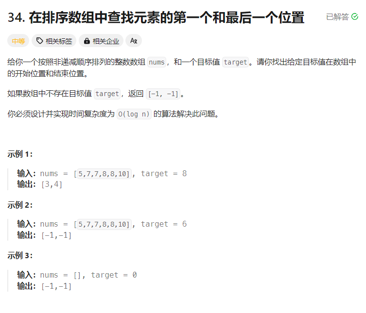

# [34.在排序数组中查找元素的第一个和最后一个位置](https://leetcode.cn/problems/find-first-and-last-position-of-element-in-sorted-array/description/)

## 题目



## 思路
- 辅助函数 `lower_bound`:
    - `lower_bound` 返回最小的满足 $nums[i] >= target$ 的 $i$
    - 如果数组为空，或者所有数都满足 $< target$，则返回 $nums.size()$
    - 要求 `nums` 是非递减的，即 $nums[i] <= nums[i + 1]$
- 查找区间为闭区间 $[0, nums.size()-1]$，则循环条件 $left<=right$ 是有意义的

## 题解
```
class Solution {
public:
    vector<int> searchRange(vector<int>& nums, int target) {
        int start = lower_bound(nums, target);
        if (start == nums.size() || nums[start] != target) {
            return {-1, -1}; //@ nums 中不存在 target
        }
        //@ 如果存在 target,则继续查找 target+1 的位置，他的前一个位置就是
        // target 的最右位置
        int end = lower_bound(nums, target + 1) - 1;
        return {start, end};
    }

    int lower_bound(vector<int>& nums, int target) {
        int left = 0, right = nums.size() - 1; //@ 闭区间 [left, right]
        while (left <= right) {                //@ 区间不为空
            //@ 循环不变量：
            //@ nums[left-1] < target
            //@ nums[right+1] >= target
            int mid = left + (right - left) / 2;
            if (nums[mid] < target) {
                left = mid + 1; //@ 范围缩小到 [mid+1, right]
            } else {
                right = mid - 1; //@ 范围缩小到 [left, mid-1]
            }
        }
        return left;
    }
};
```

## 复杂度
- 时间复杂度: $O(log⁡n)$，其中 $n$ 为 $nums$ 的长度
- 空间复杂度: $O(1)$


## 练习
- [35.搜索插入位置](https://leetcode.cn/problems/search-insert-position/description/)

- [744.寻找比目标字母大的最小字母](https://leetcode.cn/problems/find-smallest-letter-greater-than-target/description/)