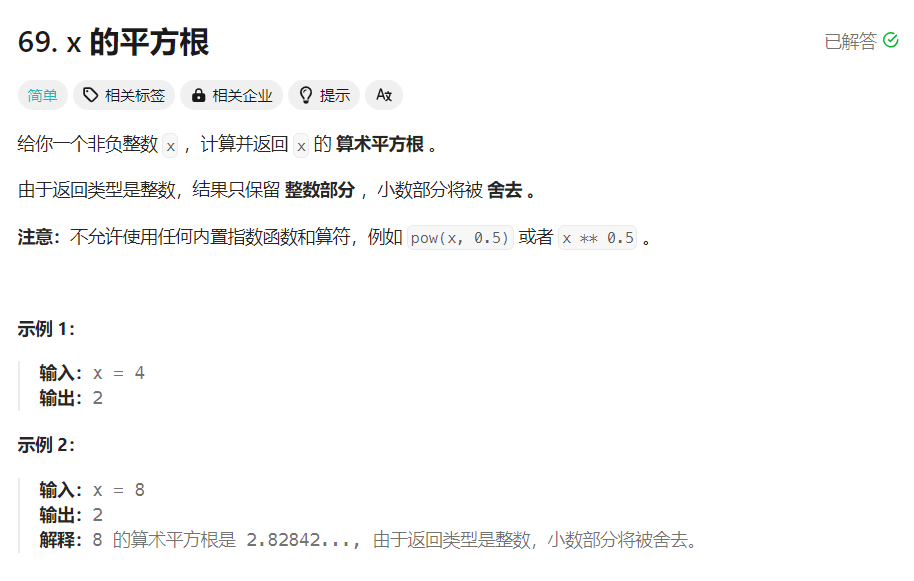

# [69.x 的平方根](https://leetcode.cn/problems/sqrtx/description/)


## 题目


## 思路
- 二分查找:
    - $x$ 的平方根的整数部分是 $k^2\le{x}$ 的最大 $k$，因此可以对 $k$ 进行二分查找
    - 注意考虑为 0 的情况
    - 为了避免数据溢出，对乘积运算做了类型提升 `long long`
- 时间复杂度: $O(log⁡x)$
- 空间复杂度: $O(1)$

## 题解
```
class Solution {
public:
    int mySqrt(int x) {
        if (x == 0) {
            return 0;
        }

        int left = 1, right = x;
        int answer = 1;
        while (left <= right) {
            int mid = left + ((right - left) >> 1);
            if ((long long)mid * mid <= x) {
                answer = mid;
                left = mid + 1;
            } else {
                right = mid - 1;
            }
        }
        return answer;
    }
};
```
