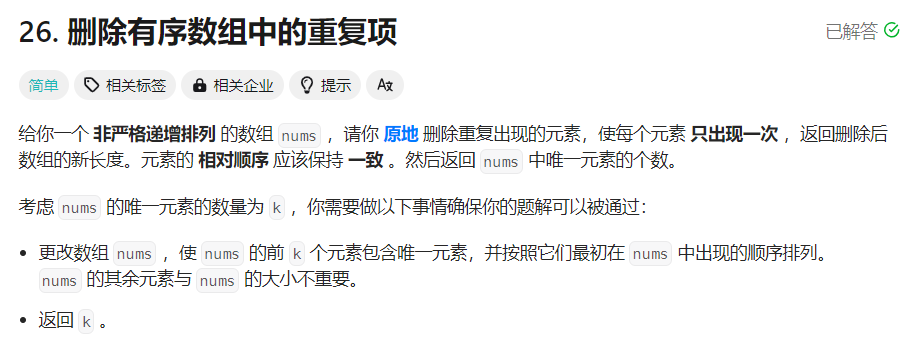

# [26.删除有序数组中的重复项](https://leetcode.cn/problems/remove-duplicates-from-sorted-array/description/)

## 题目


## 思路
- 快慢指针思路:
    - 要求是原地删除
    - 数组有序，相同的元素必定是连续的
    - 注意判断数组是否为空
    - 一次遍历整个数组
    - 快慢指针的思路，$nums[fast]$ 表示待检查的元素，$nums[slow-1]$ 表示上一个被检查元素

- 时间复杂度: $O(n)$
- 空间复杂度: $O(1)$

## 题解
```
class Solution {
public:
    int removeDuplicates(vector<int>& nums) {
        int n = nums.size();
        if (n <= 1) {
            return n;
        }

        int fast = 1, slow = 1;
        while (fast < n) {
            if (nums[fast] != nums[slow - 1]) {
                nums[slow] = nums[fast];
                slow++;
            }
            fast++;
        }
        return slow;
    }
};
```