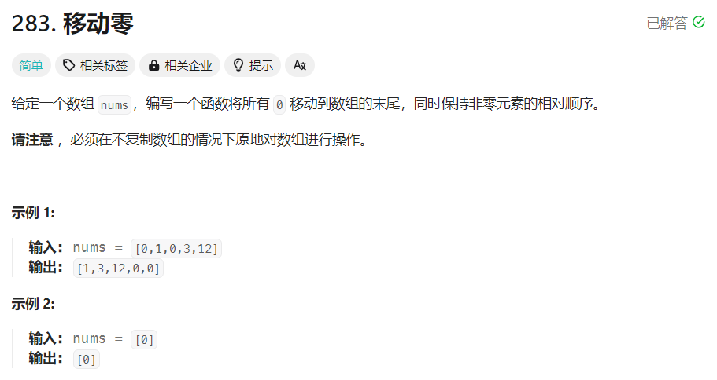

# [283.移动零](https://leetcode.cn/problems/move-zeroes/description/)


## 题目


## 思路
- 快慢指针的思路:
    - 两次遍历数组
    - 第一次遍历将不为0的数值放到数组的前面
    - 第二次遍历将不为0后面所有的数值改写为0
- 时间复杂度: $O(n)$
- 空间复杂度: $O(1)$

## 题解
```
class Solution {
public:
    void moveZeroes(vector<int>& nums) {
        int n = nums.size();
        if (n <= 0) {
            return;
        }

        int fast = 0, slow = 0;
        while (fast < n) {
            if (nums[fast] != 0) {
                nums[slow] = nums[fast];
                slow++;
            }
            fast++;
        }

        while (slow < n) {
            nums[slow] = 0;
            slow++;
        }
    }
};
```