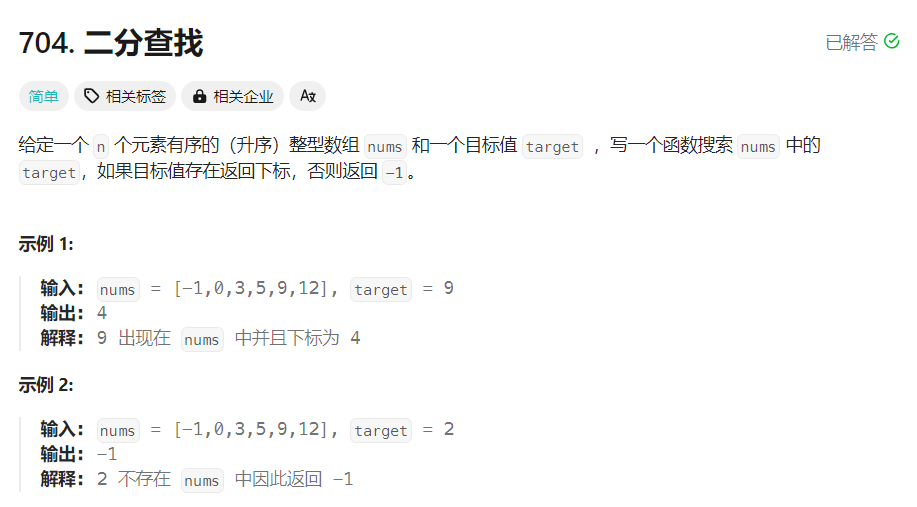

# [704. 二分查找](https://leetcode.cn/problems/binary-search/description/)

## 题目


## 思路
- 二分查找：在升序数组 $nums$ 中寻找目标值 $target$，对于特定下标 $i$，比较 $nums[i]$ 和 $target$ 的大小：
    - 如果 $nums[i]=target$，则下标 $i$ 即为要寻找的下标；
    - 如果 $nums[i]>target$，则 $target$ 只可能出现在下标 $i$ 左侧；
    - 如果 $nums[i]<target$，则 $target$ 只可能出现在下标 $i$ 右侧；
    - 定义查找的范围 $[left,right]$
    - 二分查找的条件是查找范围不为空，即 $left≤right$
- 时间复杂度：$O(log⁡n)$，其中 $n$ 是数组的长度
- 空间复杂度：$O(1)$


## 题解
```
class Solution {
public:
    int search(vector<int>& nums, int target) {
        int left = 0, right = nums.size() - 1;
        while (left <= right) {
            int mid = left + ((right - left) >> 1);
            if (nums[mid] == target) {
                return mid;
            } else if (nums[mid] > target) {
                right = mid - 1;
            } else {
                left = mid + 1;
            }
        }
        return -1;
    }
};
```
